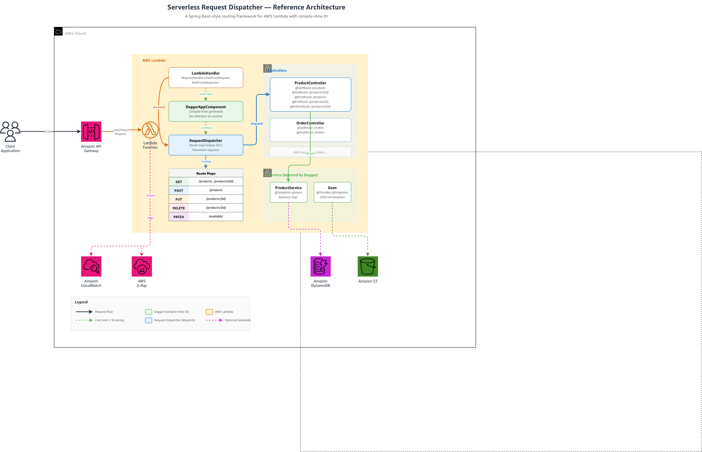

# Serverless Request Dispatcher

> **Note:** This is a sample project intended for educational and demonstration purposes. It is not intended for production use without additional security hardening. Use at your own risk.

A lightweight routing library for building Java microservices on AWS Lambda. Familiar annotation-style controllers (`@GetMapping`, `@PathVariable`) with compile-time dependency injection through Dagger — no classpath scanning, no proxy generation, and no embedded server.

## Contents

- [Getting Started](#getting-started) · [Annotations](#annotations) · [How It Works](#how-it-works)
- [Request Binding and the HTTP Status Contract](#request-binding-and-the-http-status-contract)
- [Resolving the Library Dependency](#resolving-the-library-dependency) · [Structuring Multiple Microservices](#structuring-multiple-microservices)
- [CI/CD Pipeline](#cicd-pipeline) · [Security in the Sample Template](#security-in-the-sample-template) · [Best Practices](#best-practices)
- [Design Considerations](#design-considerations) · [When Not to Use This Library](#when-not-to-use-this-library)
- [Sample Application](#sample-application) · [Measuring Cold Starts](#measuring-cold-starts) · [Cost and Cleanup](#cost-and-cleanup)

## The Problem

Java teams often want annotated controllers for a REST API served by a single Lambda function. Frameworks that discover beans and resolve dependencies through runtime reflection do that work during the Lambda initialization phase, which adds to cold start time and memory use. A hand-written `switch` over routes avoids the overhead but stops scaling after a few routes.

## The Solution

This library provides the annotation model for routing, while Dagger resolves the dependency graph at compile time and generates plain constructor calls. At cold start the dispatcher scans the registered controllers once and builds an O(1) route map; each request is a single map lookup.

To measure what this costs in your own account, use the [cold start benchmark](benchmarks/README.md). It deploys the sample next to a hand-wired `switch` baseline and a minimal controller, with and without SDK priming and SnapStart, and reports cold start percentiles for each.

## Getting Started

Clone the repository and build the library:

```bash
git clone https://github.com/aws-samples/sample-serverless-request-dispatcher.git
cd sample-serverless-request-dispatcher

# Install the library to your local Maven repository
cd serverless-request-dispatcher
mvn clean install
```

Add the dependency to your microservice's `pom.xml`:

```xml
<dependency>
    <groupId>com.amazonaws.serverless</groupId>
    <artifactId>serverless-request-dispatcher</artifactId>
    <version>1.0.0</version>
</dependency>
```

Write a controller (paths are relative — the `basePath` in `AppRequestDispatcher` is prepended automatically):

```java
public class ProductController {

    @Inject
    public ProductController(ProductService productService, Gson gson) { ... }

    @GetMapping("/products")
    public String list(@RequestParam("category") String category) { ... }

    @GetMapping("/products/{id}")
    public String get(@PathVariable("id") String id) { ... }

    @PostMapping("/products")
    public String create(String body) { ... }

    @PutMapping("/products/{id}")
    public String update(@PathVariable("id") String id, String body) { ... }

    @DeleteMapping("/products/{id}")
    public String delete(@PathVariable("id") String id) { ... }
}
```

Wire it with Dagger:

```java
@Module
public class AppModule {
    @Provides @Singleton
    public List<Object> provideControllers(ProductController controller) {
        return List.of(controller);
    }
}

// The basePath "/api" is prepended to all annotation paths.
// @GetMapping("/products") becomes route "/api/products".
@Singleton
public class AppRequestDispatcher extends FrontControllerRequestDispatcher {
    @Inject
    public AppRequestDispatcher(List<Object> controllers) {
        super(controllers, "/api");
    }
}

// Dagger component — ties the module to the dependency graph.
// Dagger generates DaggerAppComponent at compile time.
@Component(modules = {AppModule.class})
@Singleton
public interface AppComponent {
    AppRequestDispatcher requestDispatcher();
}
```

Create a Lambda handler:

```java
public class LambdaHandler implements RequestHandler<AwsProxyRequest, AwsProxyResponse> {
    private static final Gson GSON = new Gson();
    private final FrontControllerRequestDispatcher dispatcher;

    public LambdaHandler() {
        AppComponent component = DaggerAppComponent.create();
        this.dispatcher = component.requestDispatcher();
    }

    @Override
    public AwsProxyResponse handleRequest(AwsProxyRequest request, Context context) {
        try {
            Object result = dispatcher.invoke(request);
            return createResponse(200, result.toString());
        } catch (RouteException e) {
            // Route not found (no matching path/method registered)
            return errorResponse(404, "Not found");
        } catch (InvocationTargetException e) {
            // Exception thrown inside a controller method
            if (e.getCause() instanceof RouteException) {
                return errorResponse(400, e.getCause().getMessage());
            }
            return errorResponse(500, "Internal server error");
        } catch (Exception e) {
            return errorResponse(500, "Internal server error");
        }
    }

    // Serialize with Gson so quotes in a message cannot break the JSON body
    private static AwsProxyResponse errorResponse(int statusCode, String message) {
        return createResponse(statusCode, GSON.toJson(Map.of("error", String.valueOf(message))));
    }

    private static AwsProxyResponse createResponse(int statusCode, String body) {
        Headers headers = new Headers();
        headers.putSingle("Content-Type", "application/json");
        return new AwsProxyResponse(statusCode, headers, body);
    }
}
```

Deploy with SAM (from the `sample-product-service/` directory):

```bash
cd sample-product-service
mvn clean package
sam deploy --guided
```

To enable [Lambda SnapStart](https://docs.aws.amazon.com/lambda/latest/dg/snapstart.html) on the published versions that API Gateway invokes, deploy with `--parameter-overrides EnableSnapStart=true`.

## Annotations

| Annotation | Purpose |
|---|---|
| `@GetMapping("/path")` | Handle GET requests |
| `@PostMapping("/path")` | Handle POST requests |
| `@PutMapping("/path")` | Handle PUT requests |
| `@PatchMapping("/path")` | Handle PATCH requests |
| `@DeleteMapping("/path")` | Handle DELETE requests |
| `@PathVariable("name")` | Extract value from URL path |
| `@RequestParam("name")` | Extract value from query string (nullable — `null` if absent) |

Unannotated `String` parameters receive the request body. `AwsProxyRequest` and `Headers` types are injected automatically.

## Architecture



## How It Works

At compile time, Dagger generates plain Java code that wires your dependencies with direct constructor calls — no reflection for DI. At Lambda cold start, the `FrontControllerRequestDispatcher` scans your controllers once and builds an O(1) HashMap of routes. Each incoming request is a single map lookup to find the right method.

**Route matching:** Routes are matched against `AwsProxyRequest.getResource()`, which returns the API Gateway resource template (e.g., `/api/products/{id}`) — not the resolved path. Path variable values are extracted from `getPathParameters()`. This is how API Gateway proxy integration works: the template is fixed, and actual path segments are passed as parameters.

```
Compile time                              Runtime (cold start)
┌─────────────────────────┐              ┌─────────────────────────┐
│ Dagger reads @Module,   │              │ DaggerAppComponent      │
│ @Inject, @Component     │──generates──▶│ .create()               │
│ Validates dependency    │              │                         │
│ graph, generates Java   │              │ Plain new() calls for DI│
└─────────────────────────┘              │ No classpath scanning   │
                                         └─────────────────────────┘
```

## Request Binding and the HTTP Status Contract

### How parameters are bound

For each parameter of a controller method, the dispatcher applies these rules:

| Parameter | Value injected |
|---|---|
| Type `AwsProxyRequest` | The full request |
| Type `Headers` | The multi-value request headers |
| `@PathVariable("name")` | `request.getPathParameters().get("name")` |
| `@RequestParam("name")` | The first non-null value for `name` in the multi-value query string, or `null` if absent |
| Unannotated `String` | The raw request body |

The library performs no type conversion, validation, or JSON deserialization. Values are `String` or `null`.

### Signature mistakes that fail at invocation time

Route *registration* is checked at cold start, but a controller signature is only exercised when a request arrives. Cover every route with a test that asserts the returned value, not just the absence of an exception.

| Mistake | Result | Do this instead |
|---|---|---|
| `@PathVariable("id")` while the resource template uses `{productId}` | `null` is injected and the request returns **200** | Copy the `{token}` from the route path into the annotation |
| Annotation path differs from the API Gateway resource path | **404**; the controller is never invoked | Keep `basePath` + annotation path identical to the SAM event `Path` |
| `@PathVariable` on a route with no path variables | **500**, because API Gateway sends `"pathParameters": null`. Hand-built test events may hide this. | Declare `@PathVariable` only on routes that have the `{name}` segment |
| Path or query parameter declared as a primitive (`int id`) | **500** (`IllegalArgumentException` when `null` is unboxed) | Declare it as `String` and convert in the controller |
| Two unannotated `String` parameters | Both receive the same request body | Declare one body parameter per method |
| Unannotated parameter of a DTO type | **500** (argument type mismatch). The body is not deserialized. | Accept `String` and deserialize explicitly |
| Parameter with any other runtime annotation (for example, a validation annotation) | **500** (wrong number of arguments) | Keep controller signatures free of other parameter annotations |

### Status codes returned by the sample handler

| Condition | Status | Body |
|---|---|---|
| Route matched, controller returns normally | 200 | The result's `toString()`, with `Content-Type: application/json` |
| Controller throws `RouteException` | 400 | The exception message, so write these messages for clients |
| No route for the method and resource template | 404 | Generic "Not found" |
| Existing path called with an unregistered method | **404, not 405** | Each HTTP method has its own route map. Restrict methods at API Gateway if you need 405. |
| Method other than GET, POST, PUT, PATCH, DELETE (for example `OPTIONS`, `HEAD`) | 404 | Answer `OPTIONS` preflight requests with API Gateway CORS configuration |
| Malformed JSON body | Whatever the controller does | Catch the parse failure and throw `RouteException` to return 400 |
| Any other exception | 500 | Generic message; details go to the logs only |

## Resolving the Library Dependency

The library isn't published to Maven Central, so each service must be told where to find it. Choose based on how close you are to production:

| Option | Use when | Trade-off |
|---|---|---|
| A. Local install to `~/.m2` | Trying the sample; developing the library | Per-machine state, not reproducible in CI |
| B. Repository directory inside the service | One service should build with `mvn package` alone | Commits a JAR to git; doesn't scale past one or two consumers |
| C. Hosted private repository (AWS CodeArtifact, GitHub Packages) | More than one service, or any deployment pipeline | One-time setup; immutable versions and an audit trail |

**Option A** is what [Getting Started](#getting-started) uses. Re-run `mvn clean install` in `serverless-request-dispatcher/` after every library change.

**Option B.** Install the library into a `repo/` directory inside the service and commit it:

```bash
# From the repository root, after 'mvn clean install' in the library.
# maven-install-plugin 2.5.2 writes .sha1/.md5 checksums, which avoids checksum warnings.
mvn org.apache.maven.plugins:maven-install-plugin:2.5.2:install-file \
  -Dfile=serverless-request-dispatcher/target/serverless-request-dispatcher-1.0.0.jar \
  -DpomFile=serverless-request-dispatcher/pom.xml \
  -DlocalRepositoryPath=sample-product-service/repo \
  -DcreateChecksum=true
```

```xml
<repositories>
    <repository>
        <id>project-local</id>
        <url>file://${project.basedir}/repo</url>
        <releases><enabled>true</enabled><updatePolicy>never</updatePolicy></releases>
        <snapshots><enabled>false</enabled></snapshots>
    </repository>
</repositories>
```

To prove the service no longer needs the local install, resolve it with an empty local repository:

```bash
mvn -Dmaven.repo.local=/tmp/verify-m2 dependency:tree -Dincludes=com.amazonaws.serverless
```

- **Transitive dependencies still come from Maven Central.** Only the library itself lives in `repo/`.
- **Windows:** use `file:///${project.basedir}/repo` (three slashes).
- **Bump the version on every rebuild,** so a stale JAR is never reused silently.

**Option C (AWS CodeArtifact).**

1. Create the domain and repository once:

   ```bash
   aws codeartifact create-domain --domain my-domain
   aws codeartifact create-repository --domain my-domain --repository maven-internal
   ```

2. Add the repository as the deploy target in the library's `pom.xml`:

   ```xml
   <distributionManagement>
       <repository>
           <id>codeartifact</id>
           <url>https://my-domain-ACCOUNT_ID.d.codeartifact.REGION.amazonaws.com/maven/maven-internal/</url>
       </repository>
   </distributionManagement>
   ```

3. Get a token and publish:

   ```bash
   export CODEARTIFACT_AUTH_TOKEN=$(aws codeartifact get-authorization-token \
     --domain my-domain --domain-owner ACCOUNT_ID --region REGION \
     --query authorizationToken --output text)
   (cd serverless-request-dispatcher && mvn deploy)
   ```

4. In each consuming service, add the same URL under `<repositories>` with `<id>codeartifact</id>`. Supply the credentials in `~/.m2/settings.xml` or the CI equivalent, and never commit the token:

   ```xml
   <servers>
       <server>
           <id>codeartifact</id>
           <username>aws</username>
           <password>${env.CODEARTIFACT_AUTH_TOKEN}</password>
       </server>
   </servers>
   ```

The token is short-lived, so fetch it at the start of each pipeline run. GitHub Packages works the same way with a `GITHUB_TOKEN`.

> **Change the `groupId` before you publish.** `com.amazonaws.serverless` is also the namespace of the [aws-serverless-java-container](https://github.com/aws/serverless-java-container) artifacts on Maven Central. When you publish your own build, move it to your own namespace (for example `com.example.serverless`).

## Structuring Multiple Microservices

Prefer **one repository per service**, each depending on a published library version, over a multi-module parent POM:

```
Published library (recommended)            Parent POM (couples releases)
Repo: serverless-request-dispatcher        parent-pom/
Repo: order-service    ← own cadence       ├── serverless-request-dispatcher/
Repo: product-service  ← own cadence       ├── order-service/    ← rebuilt on every change
Repo: user-service     ← own cadence       └── product-service/  ← version locked to parent
```

Each team upgrades the library on its own schedule. A parent POM is appropriate only for a single team whose modules always release together.

### Versioning the library

| Change | Version bump | Example |
|---|---|---|
| Annotation or `FrontControllerRequestDispatcher` API change | Major | Renaming `@GetMapping` |
| New annotation or parameter type | Minor | Adding a new mapping annotation |
| Bug fix | Patch | Fixing `null` handling in `@RequestParam` |

Agree on these rules before a second team adopts the library:

- **Pin exact versions.** Every service declares an exact `<version>`, never a range, `LATEST`, or `SNAPSHOT`, so an upgrade is a reviewable commit.
- **Never republish a version.** Ship `1.4.3` instead of re-cutting `1.4.2`.
- **Support the previous major for a stated window,** and backport fixes to it from a maintenance branch rather than forcing an upgrade.
- **Deprecate before removing.** Mark the API `@Deprecated` in a minor release and remove it only in the next major, with a migration note in `CHANGELOG.md`.
- **Build `sample-product-service` against each release candidate** in the library's pipeline, as a contract test.

## CI/CD Pipeline

The same stages map to AWS CodePipeline with AWS CodeBuild, GitHub Actions, or GitLab CI:

| Stage | Command | Gate |
|---|---|---|
| Build and unit test | `mvn clean verify` | Fails on any Dagger graph error, test failure, or SpotBugs finding |
| Package | `sam build` | Record the artifact size and fail if it grows past your threshold |
| Validate template | `sam validate --lint` | Catches template errors before a rollback |
| Deploy to test | `sam deploy --config-env test --no-confirm-changeset` | An isolated account or stack |
| Integration test | `sample-product-service/scripts/test-api.sh <stage-base-url>` | Calls every route through API Gateway, the only place route alignment is truly verified |
| Deploy to production | `sam deploy --config-env prod` | Manual approval, or automatic behind a canary |

Two checks are specific to this design:

- **Route alignment.** An annotation path that doesn't match a SAM event path returns 404, and no unit test catches it. The integration test should call every documented route.
- **Init Duration as a release metric.** Read `Init Duration` from the `REPORT` log lines of the integration test invocations, and warn when it regresses. Dependency upgrades are the usual cause. The [benchmark](benchmarks/README.md) queries show how to extract it.

For production deployments, combine `AutoPublishAlias` with `DeploymentPreference` (a canary or linear shift with CloudWatch alarms) so that a bad release rolls back automatically.

## Security in the Sample Template

| Practice | Implementation in `sample-product-service/template.yaml` |
|---|---|
| Encryption at rest | Customer managed AWS KMS key for DynamoDB, S3, Lambda environment variables, and SQS |
| S3 access logging | Dedicated logging bucket for the product images bucket |
| S3 public access | All four public access block settings on every bucket |
| TLS only | Bucket policies deny requests that don't use TLS |
| Data protection | S3 versioning and Object Lock; DynamoDB point-in-time recovery |
| Failed invocations | Encrypted SQS dead-letter queue |
| Tracing | AWS X-Ray active tracing |
| Resource sharing | IAM Access Analyzer |
| Least privilege | SAM policy templates scoped to the specific table and bucket |

Authentication, authorization, CORS, and throttling are not configured; add them at the API Gateway layer (see [Best Practices](#best-practices)).

## Best Practices

**Controllers**
- **Keep controllers thin.** Read the bound parameters, delegate to an injected service, and return the serialized result. Put one resource's routes in each controller.
- **Validate and convert every input at the top of the method.** Throw `RouteException` for invalid input so the handler returns 400. Apply defaults for optional query parameters and bound anything you pass downstream (page sizes, string lengths). For example (illustrative; `productService.list` isn't part of the sample):

  ```java
  @GetMapping("/products")
  public String listProducts(@RequestParam("limit") String limitParam) {
      int limit = 20;
      if (limitParam != null) {
          try {
              limit = Integer.parseInt(limitParam);
          } catch (NumberFormatException e) {
              throw new RouteException("limit must be an integer");
          }
          if (limit < 1 || limit > 100) {
              throw new RouteException("limit must be between 1 and 100");
          }
      }
      return gson.toJson(productService.list(limit));
  }
  ```

**Initialization and state**
- **Do expensive work in the init phase.** Build the Dagger component in the handler constructor and bind AWS SDK clients as `@Singleton`. Read required environment variables in `@Provides` methods and fail at cold start if one is missing.
- **Don't store per-request state in singletons.** Instances are reused across invocations.

**Errors**
- **Map exceptions to status codes only in the handler.** Never return stack traces, class names, or downstream error text in a 500 body. Log them together with the Lambda request ID.

**API Gateway and routing**
- **Handle cross-cutting concerns at API Gateway.** Add an authorizer (IAM, Amazon Cognito, or Lambda), CORS, and throttling or a usage plan in the SAM template rather than in controllers.
- **Keep routes and SAM events in sync.** Use one `Api` event per annotated route. Change the API prefix by editing `basePath` and the template together, never individual annotations.

**Packaging**
- **Keep the package small.** Depend on individual AWS SDK service modules (`dynamodb`, `s3`), not the aggregate SDK. Review the shaded JAR after dependency changes. Don't add a classpath-scanning framework to a function that already routes with annotations.

**Testing and operations**
- **Test cheapest first:**
  - controller unit tests with mocks;
  - a DI graph test (`DaggerAppComponent.create()`);
  - a route registration test;
  - `sam local start-api`;
  - the deployed integration test.
- **Operate with alarms.**
  - Alarm on Lambda `Errors`, `Throttles`, p99 `Duration`, and dead-letter queue depth.
  - Log one structured line per invocation with method, route, status, duration, and request ID, because all routes share one function and one log group.
  - [Powertools for AWS Lambda (Java)](https://docs.aws.amazon.com/powertools/java/) provides structured logging, metrics, and tracing utilities, and works alongside this library.

## Design Considerations

**Integration type.** Routing matches the `resource` field of `AwsProxyRequest`, which is the API Gateway resource template such as `/api/products/{id}`. This requires API Gateway REST API **Lambda proxy integration**. SAM `Type: Api` events configure it automatically.

**JSON.** The library has no JSON dependency. Controllers return `String`, and you choose the serializer. The sample uses Gson.

**Duplicate routes.** Two methods that declare the same HTTP method and path cause a `RouteException` during initialization, so the function fails fast instead of silently overwriting a route.

**Controller lifecycle.** Dagger creates controllers once per execution environment. Each environment processes one request at a time, so controllers don't need to be thread-safe unless your code starts its own threads.

**Where reflection is still used.** Dependency injection uses generated code. Route registration scans the public methods of each controller once at initialization, and dispatch uses `Method.invoke`. The scan is linear in the number of public methods, so keep helper methods private. When an API grows large, class loading becomes the bigger cost, along with the shared memory setting, timeout, IAM role, and concurrency of one function. Split the API across functions for those reasons rather than for lookup speed, which stays a single map lookup.

**Memory and SnapStart.**
- **Memory:** Lambda allocates CPU in proportion to memory, so memory affects initialization time. Start at 512 MB and tune with [AWS Lambda Power Tuning](https://github.com/alexcasalboni/aws-lambda-power-tuning).
- **SnapStart:** [Lambda SnapStart](https://docs.aws.amazon.com/lambda/latest/dg/snapstart.html) (`EnableSnapStart=true`) restores a snapshot of the initialized environment, which includes the SDK clients built during init. The routing layer opens no connections or files during initialization.
- **SDK priming:** set `SDK_PRIMING=true` to warm up the DynamoDB and S3 clients during init with `SdkWarmUp` (canned responses, no network calls). The sample template turns it on when `EnableSnapStart=true`, so the warm-up is captured in the snapshot. On demand it moves first-request work into init, so measure before you enable it.
- **Credentials:** `LambdaCredentials` uses the container credentials endpoint when Lambda advertises it and the credential environment variables otherwise, so the same code can run on demand and with SnapStart.
- **Before enabling SnapStart,** review [SnapStart best practices](https://docs.aws.amazon.com/lambda/latest/dg/snapstart-best-practices.html) on state captured in the snapshot.

**GraalVM native images** remove the JVM from startup instead of reducing JVM work. Native images usually start faster, but they need a custom runtime and a longer build. Reflection also has to be declared in reachability metadata, which this library would need for every controller and route method. Native images give up JIT optimization of hot paths. This design keeps the standard managed runtime and ordinary Java tooling.

## When Not to Use This Library

This design is deliberately minimal. Prefer another approach when:

- **Your team already runs a framework on Lambda that meets its latency targets.** Full frameworks with build-time processing add validation, configuration, security, and testing integrations that this library doesn't have.
- **You rely on interceptors or declarative cross-cutting concerns,** such as declarative transactions, caching, or method-level security.
- **You need dynamic object graphs,** such as runtime-selected implementations or per-tenant graphs. Dagger's graph is fixed at compile time.
- **Cold start doesn't matter for the workload,** for example steady high traffic, provisioned concurrency, or asynchronous processing.
- **The function isn't behind API Gateway proxy integration,** for example a container service or a non-HTTP event source.
- **You need HTTP features the router doesn't implement:** content negotiation, automatic body deserialization and validation, 405 responses with `Allow`, wildcard or regex paths, or filter chains.

It fits best for small to medium HTTP APIs on Lambda with spiky or low-volume traffic, built by teams comfortable with explicit wiring.

## Sample Application

The [sample-product-service](sample-product-service/) is a complete working microservice with DynamoDB and S3 integration. Use it as a starting point for your own services.

```bash
# Build the library (one-time)
cd serverless-request-dispatcher
mvn clean install

# Run the sample
cd ../sample-product-service
mvn clean package
sam local start-api
```

> `sam local start-api` requires Docker. The Lambda runs locally in a container but connects to real AWS services (DynamoDB, S3) using your AWS credentials. Deploy the stack first with `sam deploy --guided` to create the resources, then use `sam local start-api` to invoke the function locally. See [sample-product-service/README.md](sample-product-service/README.md#run-locally) for details.

```bash
curl http://localhost:3000/api/products
curl -X POST http://localhost:3000/api/products \
  -H "Content-Type: application/json" \
  -d '{"name":"Keyboard","category":"Electronics","price":79.99}'
```

## Measuring Cold Starts

The [benchmarks](benchmarks/README.md) folder contains a separate SAM stack and scripts that measure cold starts of five variants built from the same JAR — a minimal controller with no AWS SDK clients, a hand-wired `switch` baseline, the sample as shipped, the sample with SDK priming, and the sample with SnapStart — across Java runtimes and memory sizes. Results are written as Markdown, JSON, and raw CSV so they can be recomputed. Deploy the benchmark stack only in a non-production test account.

## Cost and Cleanup

Deploying this sample creates AWS resources (Lambda, API Gateway, DynamoDB, S3, KMS, SQS) that may incur charges. Usage within the [AWS Free Tier](https://aws.amazon.com/free/) is typically sufficient for experimentation, but costs will vary based on request volume and data stored.

To tear down all resources when you're done:

```bash
sam delete --stack-name <your-stack-name>
```

This removes the CloudFormation stack and its resources. The S3 buckets have versioning and Object Lock enabled, and CloudFormation can't delete a bucket that still contains object versions. If you uploaded images or access logs were delivered, delete all object versions from both buckets first, then run `sam delete`. Check the AWS Management Console afterwards to confirm that no resources remain.

## Requirements

- Java 21+
- Maven 3.6+
- AWS SAM CLI
- For the benchmarks: AWS CLI, `jq`, and optionally [Artillery](https://www.artillery.io/) for load tests

## License

MIT-0 — See [LICENSE](LICENSE)

## Contributing

See [CONTRIBUTING.md](CONTRIBUTING.md)